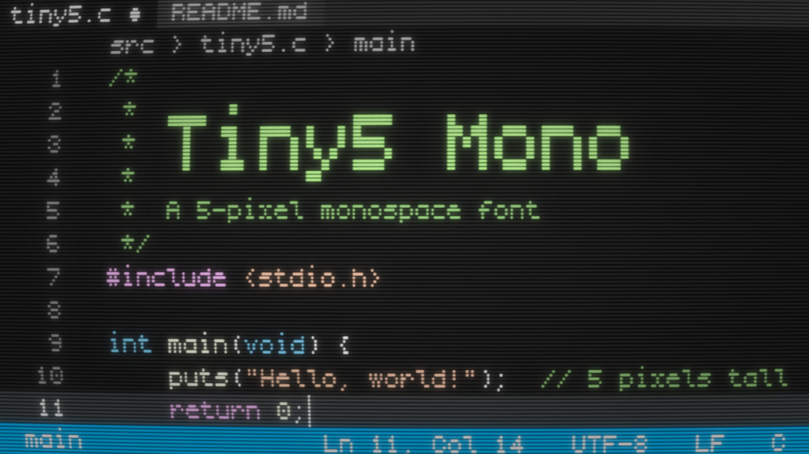
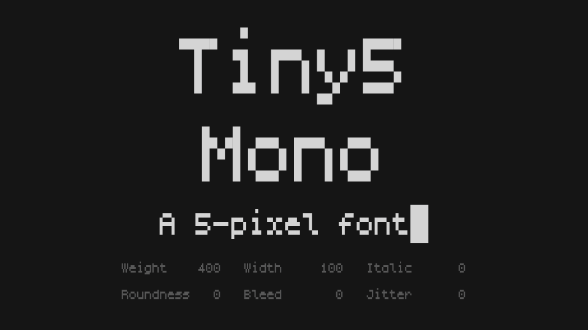
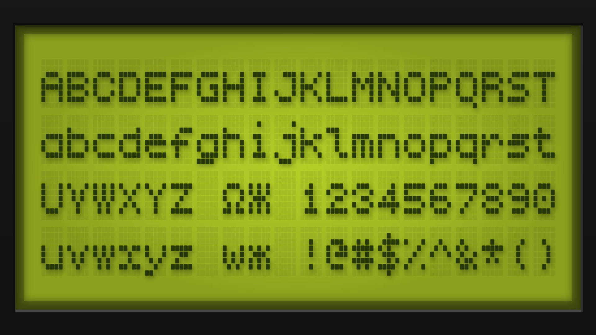
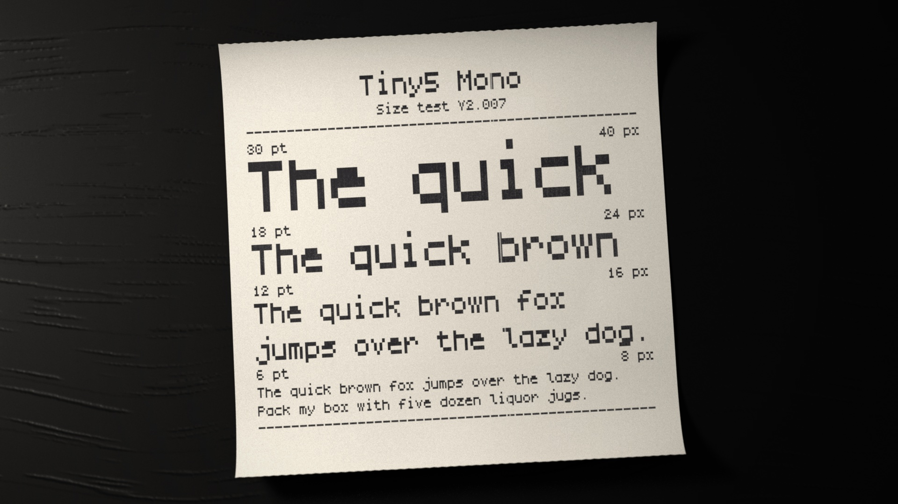
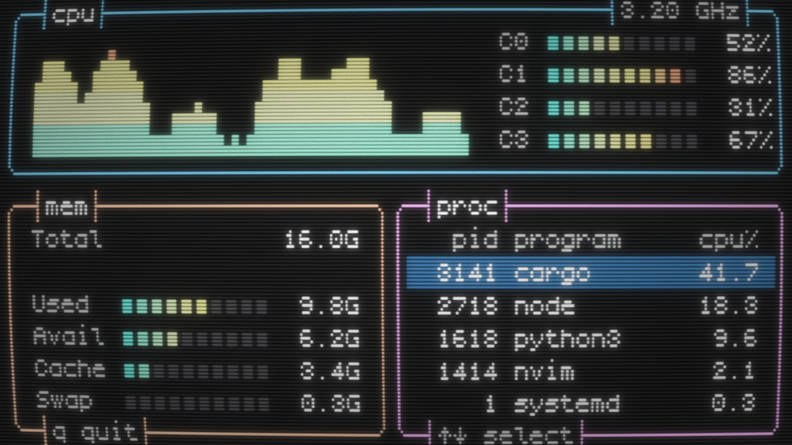
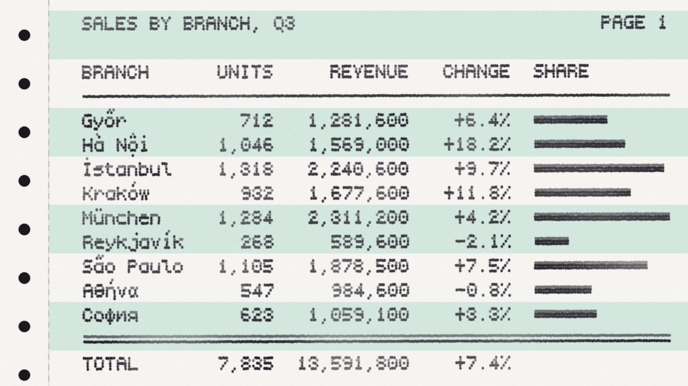

# Tiny5 Mono

**Tiny5 Mono** is the monospaced member of the [Tiny5](https://github.com/Gissio/font_Tiny5) family, a compact 5-pixel variable font that captures the essence of 1980s–90s digital minimalism. It brings the clarity and charm of Tiny5 to code editors, terminals and text-mode interfaces. Its box-drawing and block characters fill the whole cell, so frames and sextant graphics join seamlessly.

Like those of the text modes of 1980s terminals and PCs, its pixels are taller than they are wide. Lines of code stay compact, while the letterforms keep all the legibility of Tiny5.

Like Tiny5, it features six variable axes — **Weight, Width, Italic, Roundness, Bleed and Jitter**. Weight matches the stroke to your color theme, Width trades columns for breathing room, and Roundness, Bleed and Jitter take its look from crisp geometric shapes and sharp LCD edges to the soft glow of CRT monitors and the subtle ink spread of dot-matrix printers. Besides Regular, Medium, Bold, Italic and Bold Italic, the static fonts come in **LCD, CRT and Matrix** styles.

Tiny5 Mono shares its design with [**Tiny5**](https://fonts.google.com/specimen/Tiny5) and [**Tiny5 Duo**](https://fonts.google.com/specimen/Tiny5+Duo). Where Tiny5 sets text proportionally with one-pixel strokes, and Tiny5 Duo doubles its stems for bolder emphasis, Tiny5 Mono widens its narrow letters to a fixed 5-pixel width, in a cell six pixels wide and nine tall.

Tiny5 Mono excels at evoking retro-futurism, constrained-tech nostalgia and clean minimalism. It's especially well-suited for:

- Code editors, terminals and consoles
- Text-mode interfaces, ASCII and ANSI art
- Embedded systems, firmware and device displays
- Debug overlays and HUDs in pixel art and lo-fi games

It shares the broad language support of Tiny5, covering **Latin, Greek, Cyrillic and Armenian scripts** across **974 languages**, and adds complete sets of **box-drawing characters and block elements**, plus the sextants and much of **Symbols for Legacy Computing**, for a total of **2,287 glyphs**.

For crisp rows of pixels, set the font size to **increments of 6 pt (8 px)**. To make the pixels square, set the Width axis to **143.82**.

Tiny5 Mono is also available in [BDF](https://en.wikipedia.org/wiki/Glyph_Bitmap_Distribution_Format) format for seamless integration with the [mcu-renderer](https://github.com/Gissio/mcu-renderer), [u8g2](https://github.com/olikraus/u8g2) and [TFT_eSPI](https://github.com/Bodmer/TFT_eSPI) libraries.

## About

Stefan Schmidt is an electrical engineer with graduate studies in signal processing, multimodal artistic languages and sociology. Fascinated by the interplay between the virtual and the real, his work probes the boundaries between perception and technology.

Learn more at [http://www.stefanschmidtart.com](http://www.stefanschmidtart.com).

## Building

Fonts are built automatically by GitHub Actions — take a look in the "Actions" tab for the latest build.

If you want to build fonts manually on your own computer:

- `make build` will produce font files.
- `make test` will run [Fontspector](https://fonttools.github.io/fontspector/)'s quality assurance tests.
- `make proof` will generate HTML proof files.

The specimen images and videos in `documentation/` are made by `python documentation/build-specimen.py`, which also needs [Mitsuba 3](https://www.mitsuba-renderer.org) (`pip install mitsuba`) and [ffmpeg](https://ffmpeg.org) on the PATH.

## Changelog

### 2.007

- First release.

## License

This Font Software is licensed under the SIL Open Font License, Version 1.1.
This license is available with a FAQ at https://openfontlicense.org
